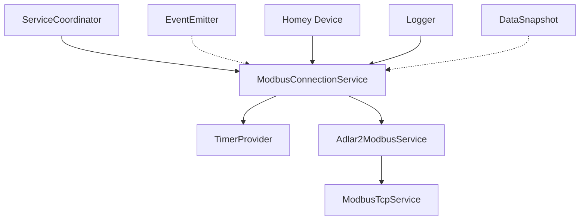

# ModbusConnectionService

Open dit bestand in de Markdown preview van je editor om het diagram te renderen.

```mermaid
flowchart TD
  SC[ServiceCoordinator] --> MCS[ModbusConnectionService]
  EE[EventEmitter] -.-> MCS
  HD[Homey Device] --> MCS
  LOG[Logger] --> MCS

  MCS --> TP[TimerProvider]
  MCS --> A2[Adlar2ModbusService]
  A2 --> TCP[ModbusTcpService]
  DS[DataSnapshot] -.-> MCS
```
